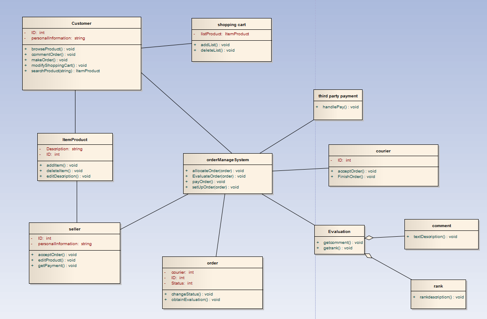
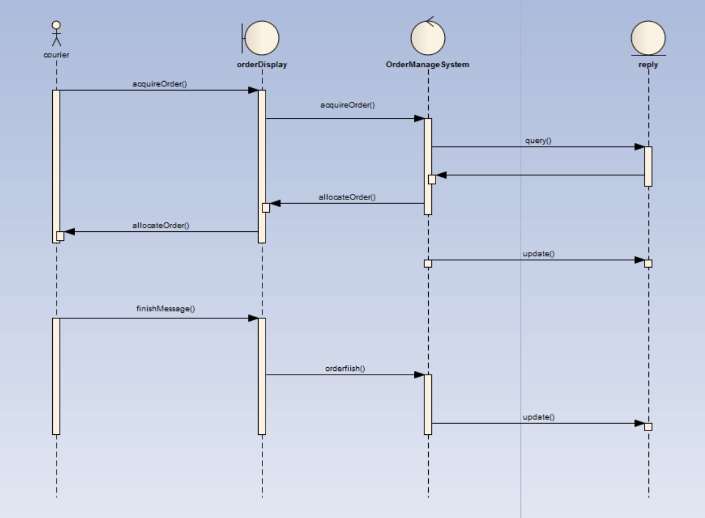
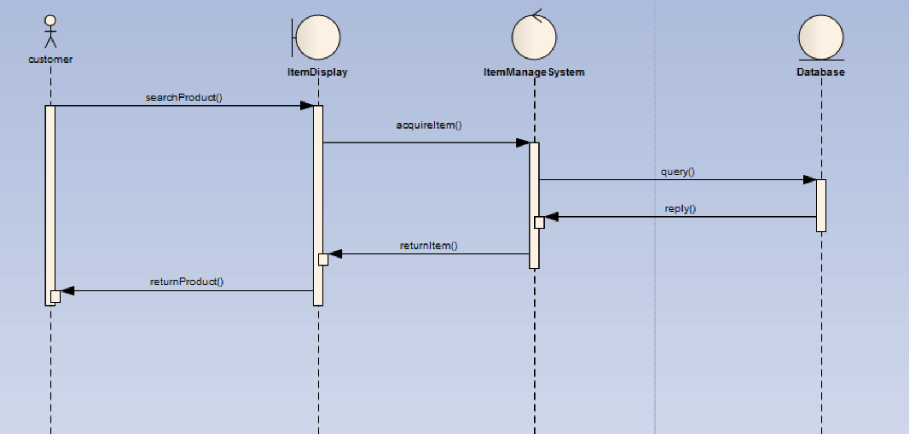
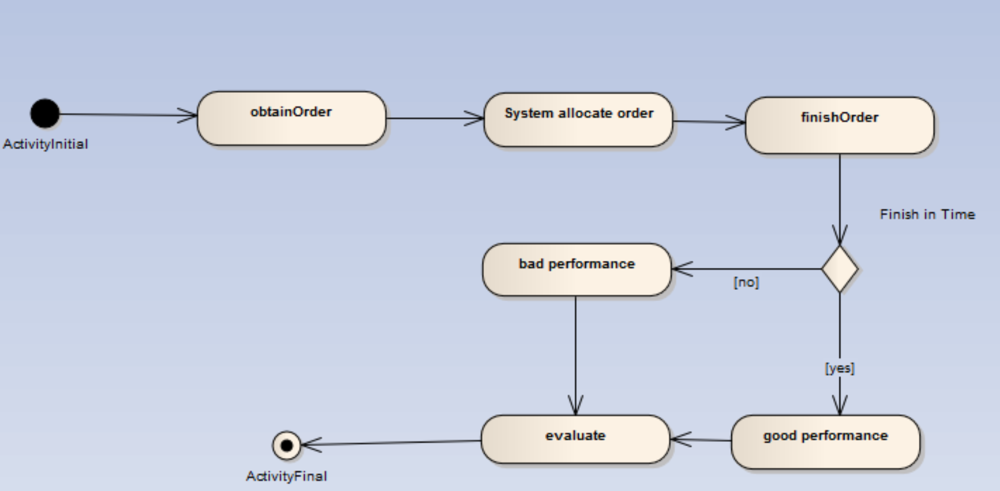

# 系统分析
## 1 类图
下图中主要类包括customer, seller, payment, courier, order, product, shopping cart, evaluation.其中由于大多数类都有与order类的交互操作，
因此设置了ordermanagesysem类作为接口类；evaluatoin由于包括评价和评分，所以由rank和comment类聚合而成。

## 2 顺序图
下图为快递员从认领订单到最后完成送达的系统顺序图。

下图买家搜索商品的系统顺序图。

## 3 活动图
下图为快递员认领订单到最后完成订单，计算运送时间是否符合要求的活动图。

