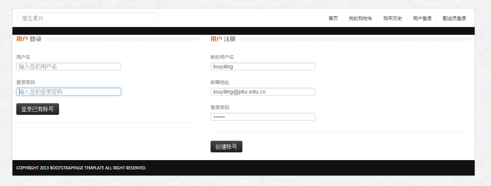
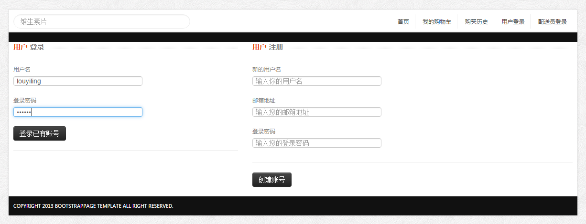
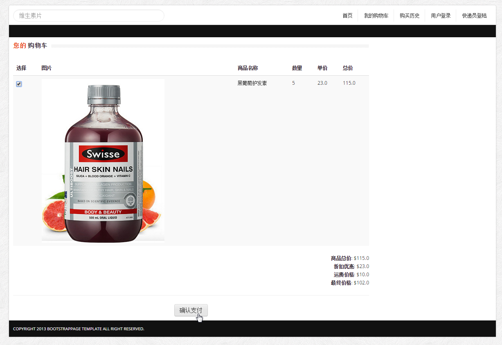

# 项目总结报告

## 甲方：自主招生系统相关文档以及系统实现

我方主要内容是开发一个供高校和考生使用的自主招生系统，相关文档如下：

* [系统需求分析](https://github.com/yilinglou/OO/blob/master/homework2/%E4%BD%9C%E4%B8%9A%E4%BA%8C--%E7%B3%BB%E7%BB%9F%E9%9C%80%E6%B1%82%E5%88%86%E6%9E%90.md) 
* [涉众分析](https://github.com/yilinglou/OO/blob/master/homework3/%E4%BD%9C%E4%B8%9A%E4%B8%89--%E6%B6%89%E4%BC%97%E5%88%86%E6%9E%90.md)

* [负责乙方一](https://github.com/liberion1994/oo)
* [负责乙方二](https://github.com/pkumercury/oo)

本项目是一个供高校和考生使用的自主招生管理系统包括网上报名和后台管理两部分。本项目的主要用户包括学校和学生两者，从考生角度希望能够提供考生上网报名、上网查询考试信息、查询成绩等等的功能，从学校角度考虑，希望可以提供其更方便管理和收集考生信息、发布相关通知的要求。

### 涉众及主要需求
#### 考生  ####
- 登陆
- 维护个人信息
- 查看考试信息
- 网上报名
- 查询成绩等
#### 考务 ####
- 登陆
- 查看管理学生信息（增删改查）
- 管理分配考场
- 查询考试成绩等
- 
### 需求变更

- 新增加的需求：用户考生可以打印准考证信息：考生可以在个人信息页打印标准格式的准考证。即系统后台需要汇集相应的考生个人信息以及考场信息以及考试时间等等为一张统一格式的表，供考生打印。

- 修改的需求：将所有考生涉及到的不同考试状态下的功能分支，汇总成一个总的状态显示，包括“考场分配中”，“成绩录入中”等等之类，进行整合。

- 删除需求：删除后台管理员涉及的EXCEL功能

### 需求变更设计初衷

## 乙方：“药急送”系统相关文档以及系统实现
* [需求分析文档](https://github.com/yilinglou/OO/blob/master/homework4/%E4%BD%9C%E4%B8%9A%E5%9B%9B--%E9%9C%80%E6%B1%82%E6%8A%A5%E5%91%8A.md)
* [系统分析文档](https://github.com/yilinglou/OO/blob/master/homework5/%E4%BD%9C%E4%B8%9A%E4%BA%94--%E7%B3%BB%E7%BB%9F%E5%88%86%E6%9E%90.md) 
* [系统设计文档](https://github.com/yilinglou/OO/blob/master/homework6/%E4%BD%9C%E4%B8%9A%E5%85%AD--%E7%B3%BB%E7%BB%9F%E8%AE%BE%E8%AE%A1.md)
* [第一阶段总结](https://github.com/yilinglou/OO/blob/master/homework7/%E7%AC%AC%E4%B8%80%E9%98%B6%E6%AE%B5%E6%80%BB%E7%BB%93%E6%8A%A5%E5%91%8A.md)
* [需求变更文档](https://github.com/wcl199343/OO-Course/blob/master/%E4%BD%9C%E4%B8%9A8%EF%BC%9A%E9%9C%80%E6%B1%82%E5%8F%98%E6%9B%B4.md)
* [需求变更应对](https://github.com/yilinglou/OO/blob/master/homework9/%E9%9C%80%E6%B1%82%E5%8F%98%E6%9B%B4%E5%BA%94%E5%AF%B9%E6%96%87%E6%A1%A3.md)

### 实现的主要需求
#### 用户 ####
- 注册
- 登陆
- 查看药品信息
- 添加购物车
- 结算
- 确认药品送达
- 评论药品

#### 快递员 ####
- 注册
- 登录
- 浏览待配送的药品
- 请求配送
- 浏览已经配送的药品

### 系统演示

#### 用户
* 注册

* 登录

* 浏览首页药品

* 浏览单独药品（库存，价格，评价）

 
* 添加药品到购物车 

* 需求更改：两件药品有折扣

* 支付药品

* 浏览历史购买，确认药品送达

* 评价药品

* 重新买一件，为后续演示快递员建立数据

#### 快递员
* 注册和注册

* 浏览待配送订单 & 请求支付订单 & 浏览历史配送订单

### 实现代码与设计模型的对应情况

### 实现时的技术难题和解决方法
* 前端网页的显示经常遇到很诡异的问题，解决方法：百度或者重启或者放弃
* 可能是因为没有使用框架，所以很多地方改动起来牵连性很大，很容易出错， 解决方法：下次会用好用的框架

### 掌握的面向对象技术和应用情况
通过这学期的学习，对于面向对象方法有了基本的认识和整体的了解，尤其因为课程一直根据进度来布置作业，让每个同学都体验了一遍开发的过程，将书本上的知识用到实际中，受益匪浅；此外由于参考书本的风格区别，也提供了多种了解这个领域的角度。
